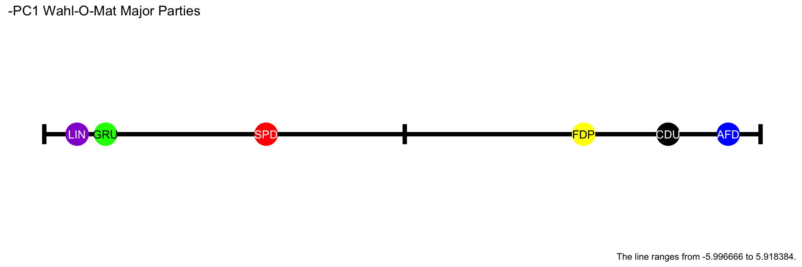
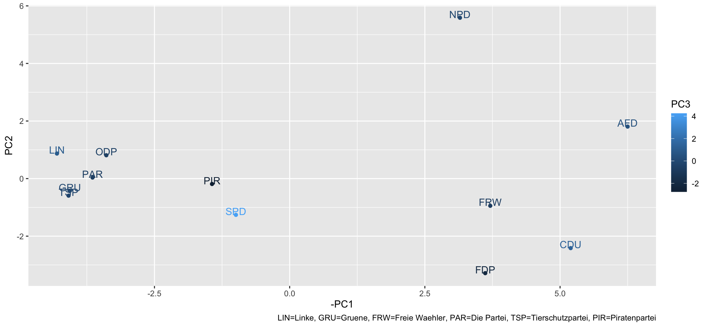

# wahl-o-mat-pca
A Principal Component Analysis (PCA) of Germany's political parties using their responses to the questions on the "Wahl-O-Mat" 2021 (https://www.wahl-o-mat.de/bundestagswahl2021/PositionsVergleichBundestagswahl2021.pdf).

The plot of the first Principal Component (PC1) of Germany's six major parties clearly show's Germany's political spectrum:

Here is a multidimensional plot, including some more, less relevant, political parties:

You can create these plots yourself using **RStudio** (https://www.rstudio.com/)!

## What is PCA?

A great explanation of PCA, by none other than Dr Mike Pound, can be found here: https://www.youtube.com/watch?v=TJdH6rPA-TI